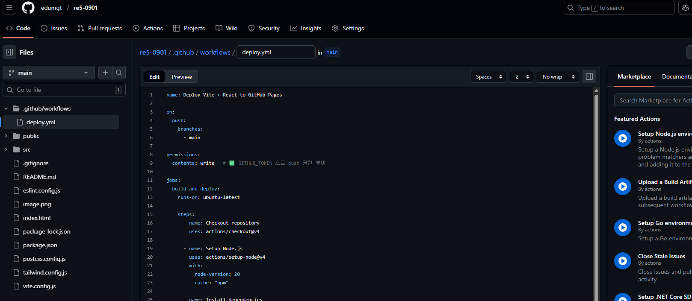

## Grid 사용 연습

## build 후 확인
npm install -g serve
serve -s dist

## gh deploy 자동화
npm install gh-pages

vite, react 기반소스를 github action 연동하여 gh pages 로
ChatGPT의 말:

좋습니다 👍
Vite + React 앱을 GitHub Pages로 자동 배포하는 GitHub Actions 설정 예제를 정리해드릴게요.

1. vite.config.js 설정

GitHub Pages는 보통 https://USERNAME.github.io/REPO 형식이므로, Vite의 base를 설정해야 합니다.

// vite.config.js
import { defineConfig } from "vite";
import react from "@vitejs/plugin-react";

export default defineConfig({
  plugins: [react()],
  base: "/REPO-NAME/", // ✅ 반드시 GitHub 저장소 이름으로 설정
});

2. package.json 수정

deploy 스크립트를 추가합니다.

{
  "name": "vite-react-app",
  "private": true,
  "version": "1.0.0",
  "scripts": {
    "dev": "vite",
    "build": "vite build",
    "preview": "vite preview",
    "deploy": "gh-pages -d dist"
  },
  "dependencies": {
    "react": "^18.3.1",
    "react-dom": "^18.3.1"
  },
  "devDependencies": {
    "vite": "^5.3.0",
    "@vitejs/plugin-react": "^4.3.0",
    "gh-pages": "^6.1.1"
  }
}

3. GitHub Actions 워크플로우 작성

.github/workflows/deploy.yml

name: Deploy Vite + React to GitHub Pages

on:
  push:
    branches:
      - main   # main 브랜치 푸시 시 실행

jobs:
  build-and-deploy:
    runs-on: ubuntu-latest

    steps:
      - name: Checkout repository
        uses: actions/checkout@v4

      - name: Setup Node.js
        uses: actions/setup-node@v4
        with:
          node-version: 20
          cache: "npm"

      - name: Install dependencies
        run: npm install

      - name: Build Vite project
        run: npm run build

      - name: Deploy to GitHub Pages
        uses: peaceiris/actions-gh-pages@v4
        with:
          github_token: ${{ secrets.GITHUB_TOKEN }}
          publish_dir: ./dist

4. GitHub Pages 설정

GitHub 저장소 → Settings → Pages 이동

Source를 gh-pages 브랜치로 변경

배포 후 주소:

https://USERNAME.github.io/REPO-NAME/

5. 실행 흐름

git push origin main → GitHub Actions 실행

Vite 앱 빌드 (npm run build)

결과물(dist/) → gh-pages 브랜치에 자동 업로드

GitHub Pages가 이를 서비스

✅ 이렇게 하면 Vite + React 앱이 main 브랜치에 푸시될 때마다 GitHub Pages로 자동 배포됩니다.

remote: Permission to edumgt/re5-0901.git denied to github-actions[bot].
  fatal: unable to access 'https://github.com/edumgt/re5-0901.git/': The requested URL returned error: 403
ChatGPT의 말:

403 에러 메시지 보니까, GitHub Actions에서 github-actions[bot]이 저장소에 push 권한이 없어서 발생하는 전형적인 상황이에요.
즉, peaceiris/actions-gh-pages가 gh-pages 브랜치에 결과물을 push하려고 했는데 권한이 거부된 겁니다.

🔍 원인

GITHUB_TOKEN 권한 문제
기본적으로 GitHub Actions가 생성하는 GITHUB_TOKEN은 “읽기 전용”일 수 있습니다.

저장소 Settings → Actions → General → Workflow permissions에서 Read repository contents permission만 활성화돼 있는 경우.

기존 브랜치 보호 규칙(Protected Branch) 때문에 gh-pages에 push 불가한 경우.

✅ 해결 방법
1. GITHUB_TOKEN 권한 부여

저장소에서 설정 변경:

Settings → Actions → General → Workflow permissions

✅ “Read and write permissions”으로 변경

배포하려는 대상이 같은 저장소의 gh-pages 브랜치 맞으세요?
아니면 다른 저장소(예: edumgt/re5-0901 → edumgt/other-repo)로 배포하려는 건가요?
➡️ 다른 저장소라면 GITHUB_TOKEN 대신 **PAT (Personal Access Token)**이 필요합니다.

나의 말:
gh-pages 브랜치 라는 걸 만들어야 하나?
ChatGPT의 말:

좋은 포인트 집으셨어요 👍

🔑 결론부터

👉 직접 gh-pages 브랜치를 미리 만들 필요는 없습니다.
배포 워크플로우(peaceiris/actions-gh-pages 같은 액션)가 빌드된 결과물(dist/)을 자동으로 gh-pages 브랜치에 push하면서, 브랜치가 없으면 새로 만들어 줍니다.

⚙️ 동작 방식

GitHub Actions 실행

npm run build → 결과물 dist/ 생성

actions-gh-pages가 dist/ 내용을 새로운 커밋으로 gh-pages 브랜치에 push

없다면 gh-pages 브랜치를 생성

있다면 gh-pages 브랜치를 덮어씀 (커밋 기록 단순화)

🚀 이후 해야 할 설정

GitHub 저장소 → Settings → Pages

Source를 Deploy from a branch로 설정

Branch: gh-pages 선택

/ (root) 선택

이렇게 하면 https://USERNAME.github.io/REPO-NAME/에서 페이지가 서비스됩니다.

✅ 요약

❌ gh-pages 브랜치 직접 안 만들어도 됨

✅ GitHub Actions가 자동 생성/갱신

🔧 GitHub Pages 설정에서 gh-pages 브랜치를 소스로 지정해야 함

이렇게 해야 github-actions[bot]이 gh-pages 브랜치에 push 할 수 있습니다.